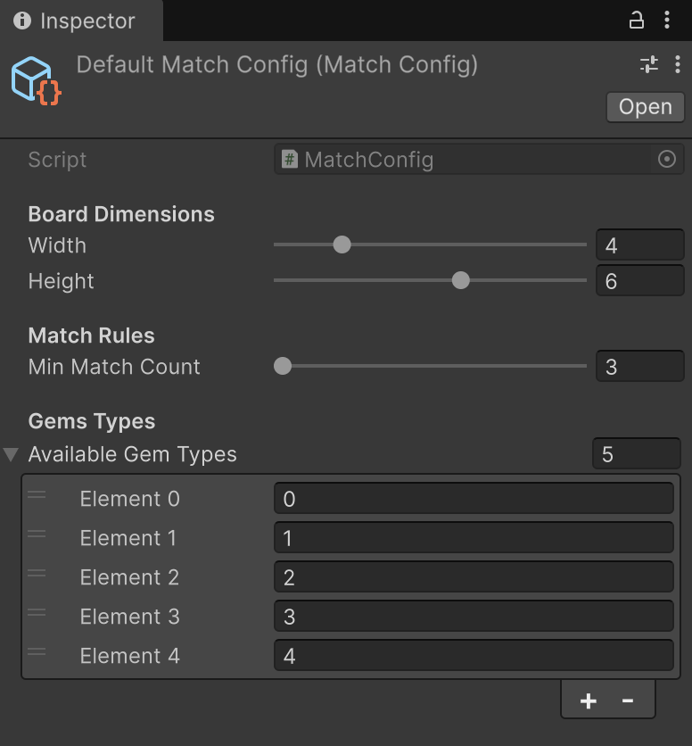
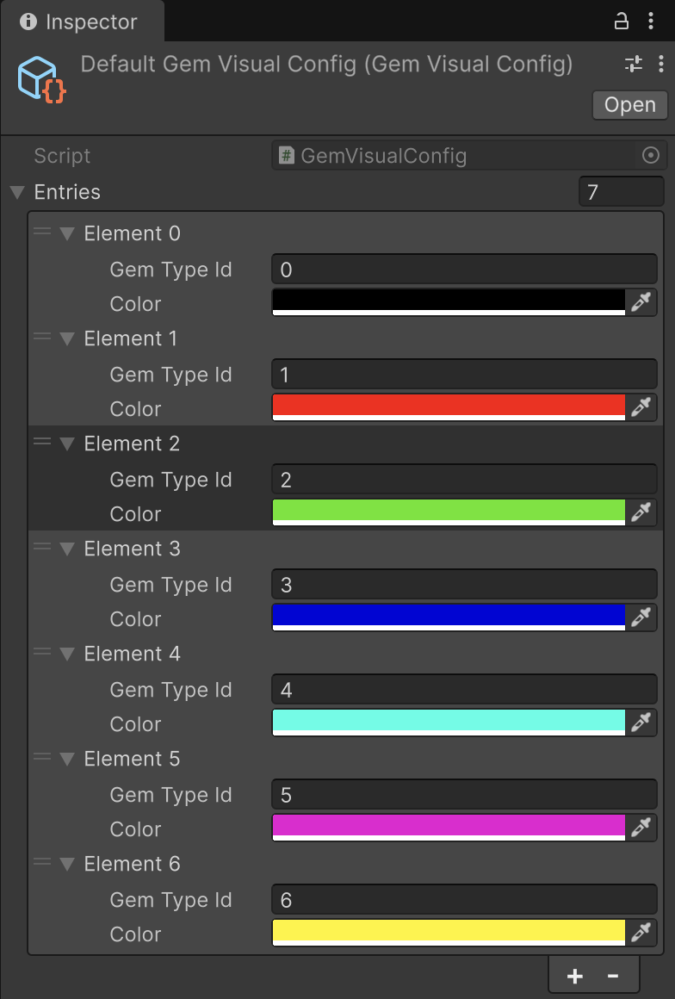
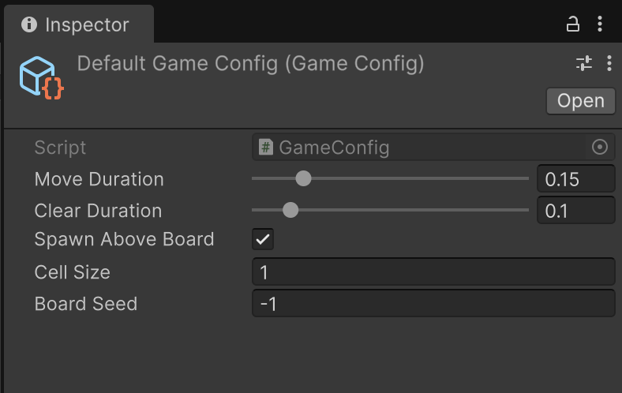
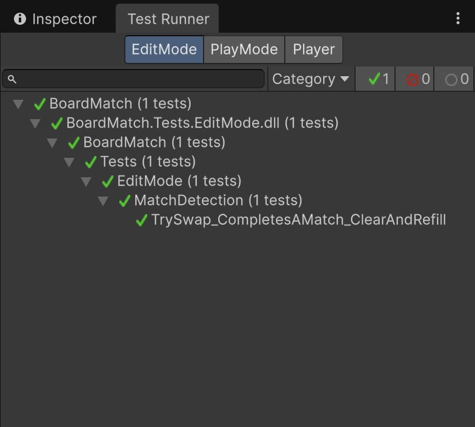

# Board Match [Match-3 Unity Game]
A modular match-3 board implementation built in Unity. Strict 
separation between core game logic and the presentation layer.

## Designer Config Files:
In Unity, right-click in the Project window and go to **Create > BoardMatch >**

1. **Match Config**  -> Configure Board Size (Width, Height), the number of same gem type
   to complete a match, gem types to use on this board 
2. **Visual Config** -> Configure the visual representation of each gem type. 
   
3. **Game Config** -> Configure the duration of gem movements, where new gems are 
   spawned, the size of gems and use seed to generate deterministic boards 

## Running Unit Tests:
1. Open Unity and go to Window > General > Test Runner.
2. Select the EditMode tab and click Run All.

## Test Devices:
The APK build has been tested and ran smoothly on these devices (59 - 60fps):
1. Samsung Galaxy S23 Ultra(12GB/256GB)
2. TECNO Pop7 (3GB/64GB) 

## Gameplay Video:
